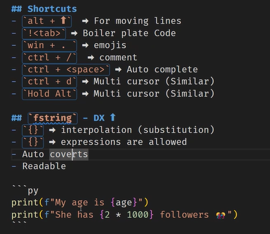
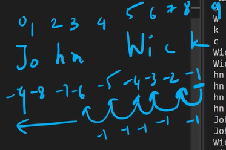
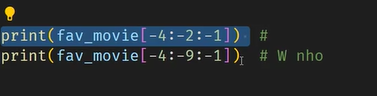

# Python - Day 03

## Shortcuts Cheat Sheet

- `! + tab` ➡️ Boiler plate Code
- `win + .` ➡️ Emojis
- `ctrl + /` ➡️ Comment
- `ctrl + Space` ➡️ Auto complete
- `Alt + keys` ➡️ Moves lines
- `ctrl + d` ➡️ Multi cursor (Similar)
- `Hold Alt` ➡️ Multi cursor (Different items selected)
- `ctrl + ~` -> Hide/Show terminal



## Operators

- Modulus ➡️ displays the remainder
  ```py
  print(9 % 2) = 1
  ```
- Exponentiation ➡️ to the power of
  ```py
  print (2**3) = 8
  ```
- Floor Division ➡️ divide then take away decimal

  ```py
  print (7 // 2) = 3.5 = 3
  ```

  ## Tables

| Operator      |     Name      | Example |
| ------------- | :-----------: | ------: |
| col 3 is      | right-aligned |   $1600 |
| col 2 is      |   centered    |     $12 |
| zebra stripes |   are neat    |      $1 |

## References

- [Markdown Cheat Sheet](https://www.markdownguide.org/basic-syntax/#headings)
- [Tables](https://github.com/adam-p/markdown-here/wiki/markdown-cheatsheet#tables)

> All comparison and logical operators return boolean

## `and`

- If any is `False` then `False`
- Only both `True` then `True`

| Operator          |  Output |
| ----------------- | ------: |
| `True and True`   |  `True` |
| ` True and False` | `False` |
| `False and True`  | `False` |
| `False and False` | `False` |

## `or`

- If any is `True` then `True`
- Only both `False` then `False`

| Operator         |  Output |
| ---------------- | ------: |
| `True or True`   |  `True` |
| ` True or False` |  `True` |
| `False or True`  |  `True` |
| `False or False` | `False` |

### Exercises

```
>>> (3 < 4) and (10 >= 5)
True
>>> (5 != 10) or (800 < 5)
True
>>> ( (80 % 5) == 0) and ( (3 * 6) == 35)
False
>>> ( 7 > 5 ) and (4 != 4 ) or (3 <= 10)
True
>>>

```

### Reverse string




