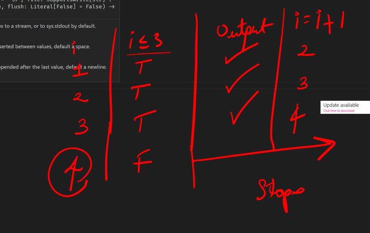

# Control flow

1. Decision tree
   1. `if..else`
   2. `if..elif..else`
2. Loops
   1. `while`
   2. `for`

## Loops

Simplify repeating statements

```py
print("Vote for Jevan")
print("Vote for Jevan")
print("Vote for Jevan")
```

### `while`

Executes the statement while the condition is true; until it is false.



```py
while(condition)
```

### for

`for` and `range` (pair)

1. `range()` always starts with 0
2. `range()` excludes the end
3. `range(start, end, step)`

```py
for i in range(3):
   print(i)
```

## Intro to Git

Motivation: Version control of your project
Be confident with your change
Linus Torvalds - side project - made Git to maintain Linux
Git - Does not need internet | Works wherever you are (i.e., on plane)

1. git innit (in terminal)
2. Stage all
3. Provide message - Why? > What?
4. When to commit
   1. Commit at least 3 times in an hour
   2. Logical commit - Complete commit (No bugs)
   3. Small commit - Don't commit > 10 files
5. Commit (Save point -> creates a version)
6. Sync to github (online)

### Git vs Github

Git - Version control system (software) - No internet required
Github - Google Drive (used for storing files)
