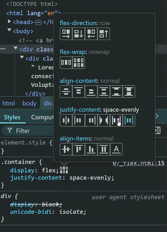
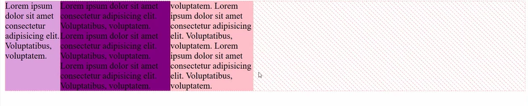

### When do we prefer Internal CSS?

- HTML -> converted into DOM Tree
- CSS -> converted into CCSOM Tree
- DOM Tree + CSSOM Tree = Render Tree

If the two doesn't combine -> no render tree -> website looks Blank ❌

index.html will be loaded -> HTML file -> External CSS (2 trips: one for HTML, and one for CSS file)
Until these two trips are complete: Screen is Blank
If External CSS is very heavy, it will take a long time to display something on the screen.
Bottleneck?
Usually the roundtrip

If you could make one trip (combine HTML and CSS) -> it will be faster.
Eliminate one roundtrip -> external CSS ❌

`Is NOT beneficial if the file (HTML + CSS section) is very long`

Could use both internal + external

- Some styling will load immediately with HTML file
- The rest will load with external CSS file

```CSS
display: inline-block
```


Inline elements doesn't respect height + width


## Inline-Block

Combination of block + inline

- Respects height + width
- Side by Side (if there is enough space)
- Stacked (Not enough space)


## Flex

We want it to work, regardless of the space.
HERO: `flex`

- Apply on parent element (not on child):
  - Applied on outer box (.container) -> not inner boxes (.box1, .box2, .box3)

ALWAYS side by side:


flex tries to `keep the height constant` -> more width is given to more wording (i.e., middle section compared to first).
extra info: flex-shrink will determine how fast it shrinks

- flex is a master of distributing empty space (when you fix width for each box)

` click box next to display: flex to choose between empty space usage`



default:



justify-content: center


- flex broke up the empty space and distributed it to each side

space-evenly vs space around:

space even has even space for every gap

space around has even space on the inside and on the outside the space is even on either side but it is half of the inside

### align-items: center


aligns content vertically/arranging boxes, in resp
stretch is default

### flex-direction

Used to stack content
