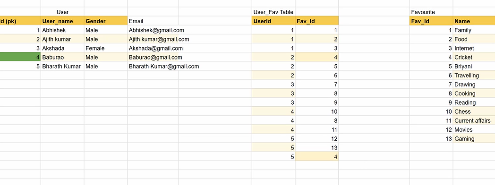
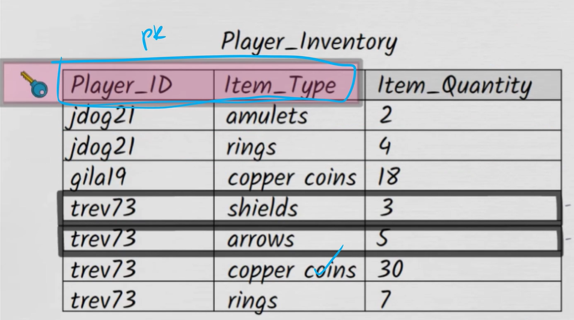
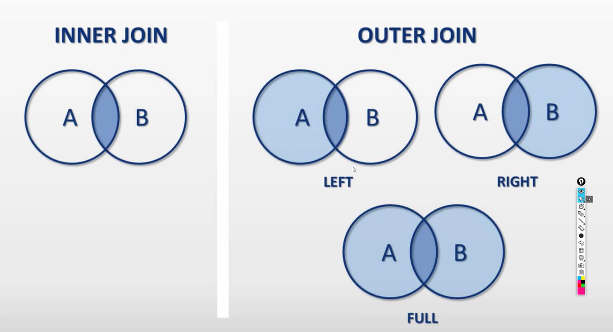

## `Why do we need joins?`

## `Why do we need mulitple tables?`

## Normalisation -

5 levels of normalisation - each level makes the data safer.

rule of normalisation: should not be comma separated (no lists)
Update anamoly - trying to update, but in the middle of updating, something crashes, now you're stuck with `inconsistent data`
If data was arranged in a different way, the update anamoly could have been avoided.

solution: separate into 2 different tables

- User table (user_id, user_name, gender, email)
- Fav things table (user_id, fav_things)

can use user id to check what their fav things are
Uses rules around normalisation - made data safer

can make data safer:
still an update anamoly in the fav table
if you need to update the name of cricket - since it's written multiple places - could crash and lead to update anamoly
add a favourite table with id's + names of favourite things
add fav_id to user_fav table

to figure out what Baburao likes:
Look at User table - find her id
Look at User_Fav table - find her id and look at the fav_id
Look at Favourite table - link the fav_id to names of favourite things

⬆️ joining tables can eliminate all this steps

### First normal form (1NF)

1. row order should not convey information
   hiding information in the row - row should not convey 2 sets of information
   data should be explicit

2. mixing data types is not allowed
   text should be in 1 row, numbers should be in a different row
   height_in_cm (integer) = Somewhere between 168 and 171 ❌
   height_in_cm (integer) = 170

3. having a table without a primary key is not permitted (we SHOULD have a primary key)

- `unique`: number / text / identification
- `not null`: primary key cannot be null value (empty)
- `only one pk in a table`: cannot have id and name as a pk in one table

4. repeating groups are not permitted

- cannot have comma separated values (list) in a column

Composite PK: combinining columns together to make primary key
Player_ID and Item_Type together becomes the primary key
There will only be one jdog21 and amulets (PK) - unique
To make use of the PK: SELECT \* FOR PI WHERE Player_ID = "jdog21" AND Item_Type = "amulets"

### Second normal form

Rule: Each non-key attribute must depend on the entire primary key.
Non-key attribute: anything that isn't a primary key

Add Player_Rating to table

Dependant:
You need both player_id + item_type to make sense of item_quantity
e.g., if you have item_type and item_quantity, WHO has it??

BUT for player_rating:
You only need player_id, not item_type (so it should be broken away - NOT in the same table)

Note:
Check each nk attribute, check if it depends on the entire primary key, if NO, break it away.

To be in second normal form:

- 1NF ✅ (should satisfy)
- 2NF ✅

### Third Normal Form:

Every non-key attribute in a table should depend on the key, the whole key, and nothing but the key (primary key).
meaning: non-key attributes should not be related/ dependant (player rating and player skill level) - player rating determines the player skill level
non-key attributes should ONLY depend on the primary key, not on each other ❌

Player_Skill_Level
Instead of 2 updates, we're only doing one update if their skill level increases

non-key -> non-key ❌

`What's the point of this?`

- Improve data safety.
- Avoid anomalies (update, delete, add anamoly) - smart way to arrange data to avoid anomalies

### Different ways to join table

- Inner join
  - Intersection (common items)
- Outer join - gives you common + extra
  - Left join (common + A items)
  - Right join (common + B items)
  - Full (common + A items + B items)

Left + Right join is interchangeable - just switch table order (A and B) to (B and A)

## Foreign key

- column that helps tables to join
- primary key in another table
- not unique - repitition is allowed
- can be null

what is the common thing between the tables (fk) - inner join?
with inner join - only common things
no Diyali and Ethan because they not assigned to a department
No Account + Procurement - no one is assigned to them

Left join:
Common + extra A items
Diyali + Ethan is added

Right join:
Common + extra B items
Diyali + Ethan excluded
Account + Procurement are added (B items)

Full join (common + A + B - inner join + left + right join):
Diyali + Ethan
Account + Procurement

SELECT \* from table A .. Inner Join table B .. (table you're joining)
ON primary key = foreign key

must specifiy which table the key is coming from:
example: A.id = B.id --> sql will get confused on which id is from which table without it
if column name is unique - don't need to specify
id (pk) - depart_id (fk)

sometimes FK and PK are the same in one table

SELECT statement -> table.column_name -> good practice
movies.\* -> selects all the columns from movies table

## Queries with aggregates (Pt.1)

CEO wants to see how each department is doing (Sales increasing?)
He wants a dashboard (a summary)
Summary -> aggregation

Aggregation functions:

- COUNT - counts no of items in column
- MIN - min val in column
- MAX - max val in column
- AVG - column average
- SUM - totals column

If company's average performance = 82
-> have to look at each department's average performance (which dept needs more improvement)
-> not concerned with each employee's avg performance

how do we do this?
`group by` - we want to group all employees in one depart
if there is a word like 'each' - giveaway to use group by

use group by with aggregation functions
whenever you use group by - other columns won't make sense - only keep aggregation column
