What types of vehicles are on the road have less than four wheels?", or "How many models of cars does Tesla produce?" - query the database

Ask & Receive - how to write SQL queries:
SELECT \* FROM mytable -> selecting all columns

SQL is not case-sensitive

## Exercise 1:

1. Find the title of each film

   ```sql
   SELECT title
   FROM movies;

   ```

2. Find the director of each film

   ```sql
    SELECT director
    FROM movies;
   ```

3. Find the title and director of each film

   ```sql
   SELECT title, director
   FROM movies;
   ```

4. Find the title and year of each film

   ```sql
   SELECT title, year
   FROM movies;
   ```

5. Find all the information about each film

   ```sql
   SELECT *
   FROM movies;
   ```

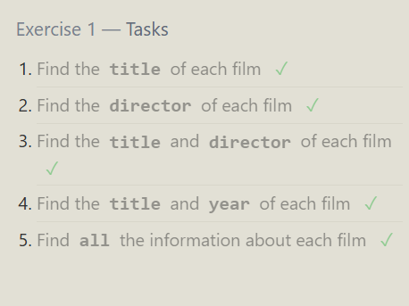

`WHERE` statement - similar to list comprehension
BETWEEN..AND..
; - marks end of statement

## Exercise 2

1. Find the movie with a row id of 6

   ```sql
   SELECT *
   FROM movies
   WHERE id = 6;
   ```

2. Find the movies released in the years between 2000 and 2010

   ```sql
   SELECT *
   FROM movies
   WHERE year BETWEEN 2000 AND 2010;
   ```

3. Find the movies not released in the years between 2000 and 2010

   ```sql
   SELECT *
   FROM movies
   WHERE year NOT BETWEEN 2000 AND 2010;
   ```

4. Find the first 5 Pixar movies and their release year

   ```sql
   SELECT title, year
   FROM movies
   WHERE id IN (1, 2, 3, 4, 5);
   ```

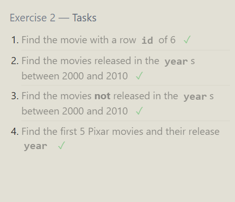

- Case has to match with = (case-sensitive)
- LIKE is not case sensitive (will match uppercase, lowercase, etc.)
- NOT LIKE - opposite
- can only use % with LIKE (not =)
- % is a placeholder
  - %AT% - anything with AT will work
  - %AT - at has to be at the end
  - AT% - has to be in the start
  - %AT% - matches ATTENTION - even if there isn't anything in front of AT (0 or more - can have 0 or many letters)
- \_ works like exactly one (we only want one letter)
  - AN\_ - ANDY ❌ (2 letters after AN)
  - AN\_ - ANI ✅
  - can use many underscores
- Be specific with LIKE

## Exercise 3

1. Find all the Toy Story movies

   ```sql
   SELECT *
   FROM movies
   WHERE title LIKE "Toy Story%";
   ```

2. Find all the movies directed by John Lasseter

   ```sql
   SELECT *
   FROM movies
   WHERE director LIKE "John Lasseter";
   ```

3. Find all the movies (and director) not directed by John Lasseter

   ```sql
   SELECT *
   FROM movies
   WHERE director NOT LIKE "John Lasseter";
   ```

4. Find all the WALL-\* movies

Answer 1:

    ```sql
    SELECT *
    FROM movies
    WHERE title LIKE "WALL-%";
    ```

Answer 2:

    ```sql
    SELECT *
    FROM movies
    WHERE title LIKE "WALL-_";
    ```

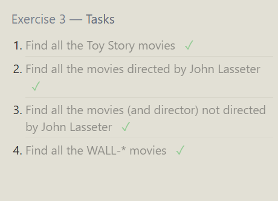

distinct eliminates duplicate values (only leaves original)
entire row has to be a duplicate for it to work

order - clause
SQL statement or query
where & order by is clause
order by will sort by column values
by default it will order ascending order
asc - ascending
desc - descending

limit & offset clause
(goes hand in hand)
limit - you have 100 rows, you only want top 5
limit 5 (first five alone)
you want to skip first 2 - want next 5 (from 3 onwards)
OFFSET is like skip
LIMIT 5 OFFSET 2 (will skip first 2)

SELECT director from movies - you'll get duplicate
SELECT distinct director from movies - removes duplicate names

SELECT DISTINCT director, year FROM movies - there will be duplicate names because years are different (didn't direct 2 movies in one year)

## Exercise 4

1. List all directors of Pixar movies (alphabetically), without duplicates

   ```sql
   SELECT DISTINCT director
   FROM movies
   ORDER BY director;
   ```

2. List the last four Pixar movies released (ordered from most recent to least)

   ```sql
   SELECT * FROM movies
   ORDER BY year DESC
   LIMIT 4;
   ```

3. List the first five Pixar movies sorted alphabetically

   ```sql
   SELECT *
   FROM movies
   ORDER by title
   LIMIT 5;
   ```

4. List the next five Pixar movies sorted alphabetically

   ```sql
   SELECT *
   FROM movies
   ORDER BY title
   LIMIT 5 OFFSET 5;
   ```

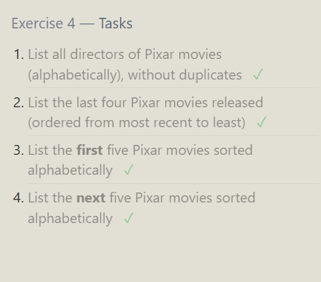

longitude - vertical
towards east, longitude increase
latitude - ---------- horizontal\*
towards north, it increases

## Review 1

1. List all the Canadian cities and their populations

   ```sql
   SELECT *
   FROM north_american_cities
   WHERE Country = "Canada";
   ```

2. Order all the cities in the United States by their latitude from north to south

   ```sql
   SELECT *
   FROM north_american_cities
   WHERE Country = "United States"
   ORDER BY latitude DESC;
   ```

3. List all the cities west of Chicago, ordered from west to east

order it from smallest to largest (asc)

    ```sql
    SELECT *
    FROM north_american_cities
    WHERE longitude < -87.629798
    ORDER by longitude;
    ```

it is better to use a subquery (query inside another query), and not hard-code longitude value
first inside query gets executed then outer query gets executed

    ```sql
    SELECT *
    FROM north_american_cities
    WHERE longitude < (SELECT longitude
    FROM north_american_cities
    WHERE City = "Chicago"
    )
    ORDER BY longitude;
    ```

4. List the two largest cities in Mexico (by population)

   ```sql
   SELECT *
   FROM north_american_cities
   WHERE Country = 'Mexico'
   ORDER BY population DESC
   LIMIT 2;
   ```

5. List the third and fourth largest cities (by population) in the United States and their population

   ```sql
   SELECT *
   FROM north_american_cities
   WHERE Country = "United States"
   ORDER BY population DESC
   LIMIT 2 OFFSET 2;
   ```

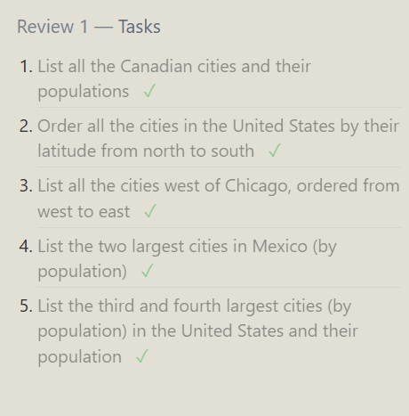

## Exercise 6

see if you need join first - then use it.
why didn't we use left join? it would give us all movie items (e.g., movies that have no sales)

1. Find the domestic and international sales for each movie ✓

   ```sql
   SELECT * FROM movies
   INNER JOIN boxoffice
      ON movies.id = boxoffice.movie_id;
   ```

2. Show the sales numbers for each movie that did better internationally rather than domestically

   ```sql
   SELECT *
   FROM movies
   INNER JOIN boxoffice
       ON movies.id = boxoffice.movie_id
   WHERE boxoffice.international_sales > boxoffice.domestic_sales;
   ```

3. List all the movies by their ratings in descending order

   ```sql
   SELECT movies.title, boxoffice.rating
   FROM movies
   INNER JOIN boxoffice
       ON movies.id = boxoffice.movie_id
   ORDER BY rating DESC;
   ```

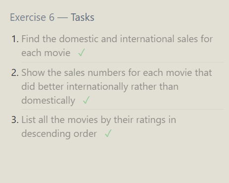

only 1e and 2w has employees - don't need join - employees table shows what buildings they belong to

## Exercise 7

1. Find the list of all buildings that have employees ✓

   ```sql
   SELECT DISTINCT building
   FROM employees;
   ```

2. Find the list of all buildings and their capacity

   ```sql
   SELECT *
   FROM buildings;
   ```

3. List all buildings and the distinct employee roles in each building (including empty buildings)

   ```sql
   SELECT DISTINCT buildings.building_name, employees.role
   FROM buildings
   LEFT JOIN employees
       ON buildings.building_name = employees.building;
   ```

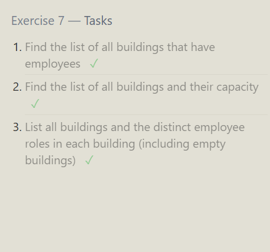

if table is on left side - left join - syntax ✅
`NOTE: whichever table is left of the 'left join' words, you get extra tables from.`

if you want null:
IS NULL
if you don't want null:
IS NOT NULL

## Exercise 8

1. Find the name and role of all employees who have not been assigned to a building ✓

   ```sql
   SELECT *
   FROM employees
   WHERE building IS NULL;
   ```

2. Find the names of the buildings that hold no employees

   ```sql
   SELECT buildings.building_name
   FROM buildings
   LEFT JOIN employees
       ON buildings.building_name = employees.building
   WHERE employees.building IS NULL;
   ```

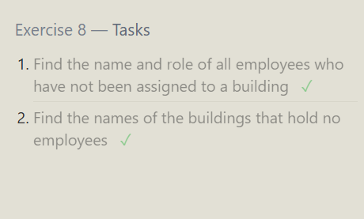

Formatting output

AS .. - changes column name to whichever name you set it as
ABS (absolute numbers)
you can also / column integers

## Exercise 9

1. List all movies and their combined sales in millions of dollars ✓

   ```sql
   SELECT movies.title, (boxoffice.domestic_sales + boxoffice.international_sales) / 1000000 AS Total_Sales
   FROM movies
   INNER JOIN boxoffice
       ON movies.id = boxoffice.movie_id;
   ```

2. List all movies and their ratings in percent

   ```sql
   SELECT movies.title,
       (boxoffice.rating * 10) AS Percent_Ratings
   FROM movies
   INNER JOIN boxoffice
       ON movies.id = boxoffice.movie_id;
   ```

3. List all movies that were released on even number years

   ```sql
   SELECT title
   FROM movies
   WHERE year % 2 = 0;
   ```

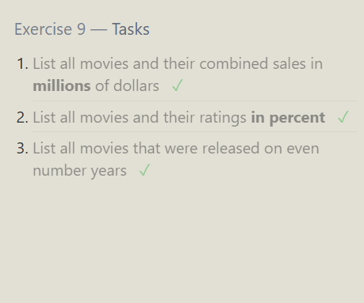

## Exercise 10

`each` - clue: GROUP BY

1. Find the longest time that an employee has been at the studio ✓

   ```sql
   SELECT *, max(years_employed)
   FROM employees;
   ```

2. For each role, find the average number of years employed by employees in that role

   ```sql
   SELECT role, avg(years_employed)
   FROM employees
   GROUP BY role;
   ```

3. Find the total number of employee years worked in each building

   ```sql
   SELECT building, SUM(years_employed) AS Total_Years
   FROM employees
   GROUP BY building;
   ```

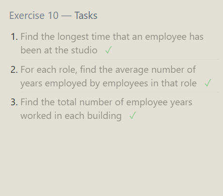

## Exercise 11 — Tasks

- sometimes you don't need group by, you can just use where clause.
- WHERE clause is a filter, HAVING clause is also a filter.
- Why another filter?
  - HAVING is a filter `after` GROUP BY
  - WHERE is a filter `before` GROUP BY

1. Find the number of Artists in the studio (without a HAVING clause)

   ```sql
   SELECT role, COUNT(role)
   FROM employees
   WHERE role = "Artist";
   ```

2. Find the number of Employees of each role in the studio

   ```sql
   SELECT role, count(role)
   FROM employees
   GROUP BY role;
   ```

3. Find the total number of years employed by all Engineers

   ```sql
   SELECT role, SUM(years_employed) AS Total_years
   FROM employees
   WHERE role = "Engineer";
   ```

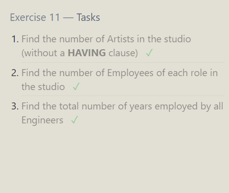

Order of execution

1. WHERE ..
2. GROUP BY ..
3. HAVING ..
4. ORDER BY ..
5. LIMIT .. OFFSET

## Exercise 12

1. Find the number of movies each director has directed

   ```sql
   SELECT director, COUNT(title) AS Movies_directed
   FROM movies
   GROUP BY director;
   ```

2. Find the total domestic and international sales that can be attributed to each director
   `clue: each director - group by director`

   ```sql
   SELECT movies.director,
       SUM(boxoffice.international_sales + domestic_sales)
       AS Total_Sales
   FROM movies
   INNER JOIN boxoffice
       ON movies.id = boxoffice.movie_id
   GROUP BY director;
   ```

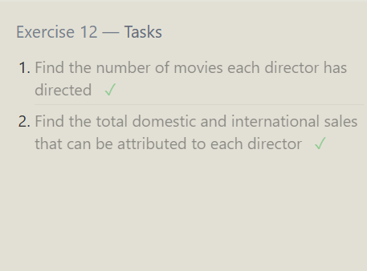

SQL Lesson 13: Inserting rows
Learning CRUD -> table data

if you're giving values in right order (with columns) - you don't have to mention column name.
multiple rows can be added at one time
VALUES (..), (..)

## Exercise 13

1. Add the studio's new production, Toy Story 4 to the list of movies (you can use any director)

   ```sql
   INSERT INTO movies
   VALUES (4, 'Toy Story 4', 'Jamie Isaacs', 2025, 120);
   ```

2. Toy Story 4 has been released to critical acclaim! It had a rating of 8.7, and made 340 million domestically and 270 million internationally. Add the record to the BoxOffice table.

   ```sql
   INSERT INTO boxoffice
   VALUES (4, 8.7, 340000000, 270000000);
   ```

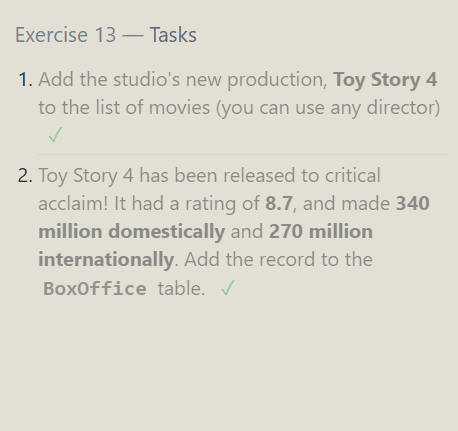

UPDATE steps:

1. SELECT statement - check what you're going to update (check whether it's the correct rows)
2. Change select to UPDATE or DELETE

When to use update:

- Correction purposes
- Constantly needing to change values (increase or decrease)

update table
set column1 = value1,
column2 = value2
where clause

## Exercise 14

1. The director for A Bug's Life is incorrect, it was actually directed by John Lasseter

   ```sql
   UPDATE movies
   SET director = 'John Lasseter'
   WHERE title = "A Bug's Life";
   ```

2. The year that Toy Story 2 was released is incorrect, it was actually released in 1999

   ```sql
   UPDATE movies
   SET year = 1999
   WHERE title = "Toy Story 2";
   ```

3. Both the title and director for Toy Story 8 is incorrect! The title should be "Toy Story 3" and it was directed by Lee Unkrich

   ```sql
   UPDATE movies
   SET title = "Toy Story 3",
       director = "Lee Unkrich"
   WHERE title = "Toy Story 8";
   ```

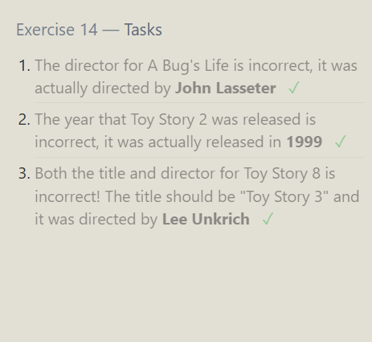

## Exercise 15

1. This database is getting too big, lets remove all movies that were released before 2005.

   ```sql
   SELECT *
   FROM movies
   WHERE year < 2005;

   DELETE FROM movies
   WHERE year < 2005;
   ```

2. Andrew Stanton has also left the studio, so please remove all movies directed by him.

   ```sql
   SELECT *
   FROM movies
   WHERE director = "Andrew Stanton";

   DELETE
   FROM movies
   WHERE director = "Andrew Stanton";
   ```

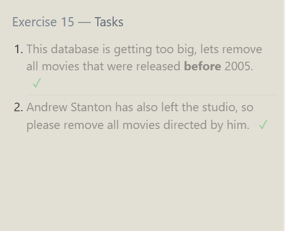

## Exercise 16

1. Create a new table named Database with the following columns:
   – Name A string (text) describing the name of the database
   – Version A number (floating point) of the latest version of this database
   – Download_count An integer count of the number of times this database was downloaded

This table has no constraints.

```sql
CREATE TABLE Database (
    Name TEXT,
    Version FLOAT,
    Download_count INTEGER
);
```

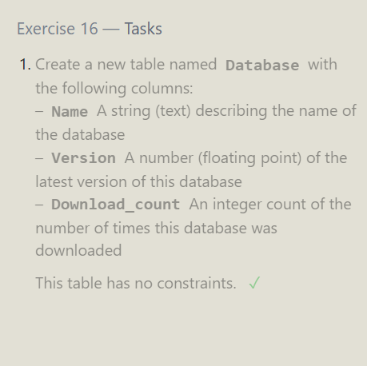

## Exercise 17

1. Add a column named Aspect_ratio with a FLOAT data type to store the aspect-ratio each movie was released in.

   ```sql
   ALTER TABLE movies
   ADD Aspect_ratio FLOAT;
   ```

2. Add another column named Language with a TEXT data type to store the language that the movie was released in. Ensure that the default for this language is English.

We want default language to be english (already filled in the column).

```sql
ALTER TABLE movies
ADD Language TEXT
    DEFAULT 'English';
```

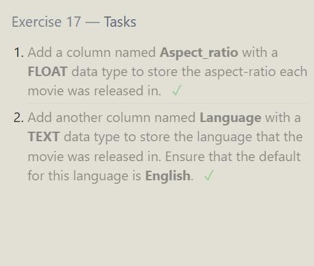

## Exercise 18

1. We've sadly reached the end of our lessons, lets clean up by removing the Movies table

   ```sql
   DROP TABLE movies;
   ```

2. And drop the BoxOffice table as well

   ```sql
   DROP TABLE BoxOffice;
   ```

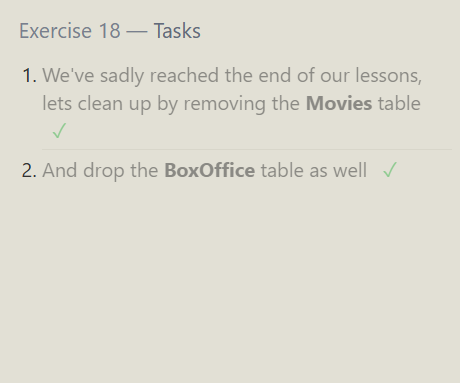
