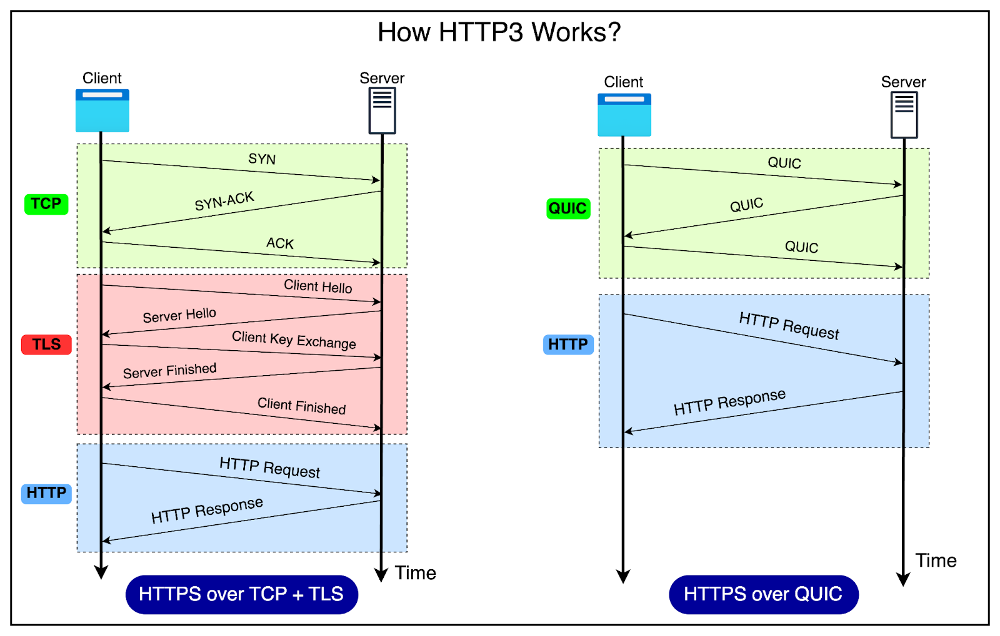

# **HTTP/2 vs HTTP/3**

### 
**By Jamie**

---

## **What is HTTP/3?**

**Hypertext Transfer Protocol (HTTP)** is the fundamental protocol (rules) used for transferring data over the web.
HTTP/3 is the **latest version** of HTTP, designed to address the limitations of **HTTP/2** and enhance web performance.

### **Key Differences Between HTTP/2 and HTTP/3:**

### 1. **Protocol Used**

- **HTTP/2** uses **TCP** (Transmission Control Protocol) for data transmission.
- **HTTP/3** uses **QUIC** (Quick UDP Internet Connections), which operates over **UDP**.
  This change allows HTTP/3 to overcome some of the limitations of TCP, providing a faster and more efficient connection.

### 2. **Head-of-Line (HOL) Blocking**

- **HTTP/2** suffers from **Head-of-Line (HOL) blocking** issues, where clients must wait for previous requests to finish before sending new ones.
- **HTTP/3** eliminates HOL blocking by allowing **independent streams** within a single connection.

### 3. **Performance Improvements**

- **QUIC** used in HTTP/3 allows for **faster connection establishment** and **better error handling**.
- **HTTP/3** is more resilient to **packet loss** and **network disturbances**, improving overall performance.

### 4. **Connection Migration**

- **HTTP/2** does not support **network migration**. If a connection is lost or interrupted (e.g., switching networks), a new connection must be established.
- **HTTP/3** supports **connection migration**, allowing connections to seamlessly continue, even when the network changes.

### 5. **Congestion Control**

- **HTTP/2** uses TCP-based congestion control mechanisms.
- **HTTP/3** enhances congestion control using QUIC-based protocols, improving overall network management and reducing delays.

### 6. **TLS Encryption**

- **HTTP/2** allows **optional TLS encryption**.
- **HTTP/3** **requires TLS encryption** by default within the **QUIC protocol**, enhancing security.

---

**Conclusion:**
HTTP/3 represents a significant leap forward in web technology, providing **improved speed, security, and resilience** compared to HTTP/2. By addressing key issues like Head-of-Line blocking, connection migration, and congestion control, HTTP/3 aims to create a better browsing experience across the internet.
